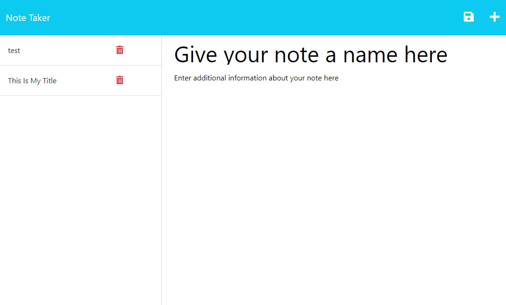

  

  # Note-Taker

  ## Description
  
  This repository contains the files for a note-taking app to make and delete notes on your to-do list. The note taker app utilizes node and express to make a non-static application that is launched via Heroku.

  ## Table of Contents

- [Installation](#installation)
- [Usage](#usage)
- [License](#license)
- [Contributing](#contribution)
- [Tests](#tests)
- [Questions](#questions)

## Installation

Go to https://note-taker-joaqsala.herokuapp.com/notes and get started or clone the respository at https://github.com/joaqsala/Note-Taker as starter code to make your own.

## Usage 

This application makes keeping track of your to-do list a breeze. Simply open the app and enter a name for your note. Provide any additional information desired to make your note complete, and then click the save button on the top right. Your note will be transferred to the left-hand side for easy viewing. Enter as many notes as you need, and then click on the trashcan icon once the to-do is tah-done!

## License

This project is covered under the MIT License.
 
  https://opensource.org/license/mit/

## Contribution

Contributions are always welcomed. Please submit a pull request.

## Tests

Open the app and tests its unctionality.

## Questions

For any questions, please feel free to reach out. 

Github username: https://github.com/joaqsala

Email: joaqsala@gmail.com
